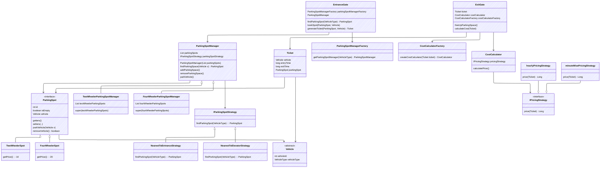

```mermaid
---
config:
  look: handDrawn
  layout: elk
---
classDiagram
class ParkingSpot {
    <<interface>>
	int id
	boolean isEmpty
	Vehicle vehicle
	getters()
	setters(..)
	parkVehicle(Vehicle v)
	removeVehicle() boolean
}
class TwoWheelerSpot {
    getPrice() : 10
}
class FourWheelerSpot {
    getPrice() : 20
}
class ParkingSpotManager {
	List<ParkingSpot> parkingSpots
	IParkingSpotStrategy parkingSpotStrategy
	ParkingSpotManager(List<ParkingSpot> parkingSpots)
	findParkingSpace(Vehicle v) ParkingSpot
	addParkingSpace()
	removeParkingSpace()
	parkVehicle()
}
class TwoWheelerParkingSpotManager {
	List<ParkingSpot> twoWheelerParkingSpots
	super(twoWheelerParkingSpots)
}
class FourWheelerParkingSpotManager {
	List<ParkingSpot> fourWheelerParkingSpots
	super(fourWheelerParkingSpots)
}
class IParkingSpotStrategy {
	findParkingSpot(VehicleType) : ParkingSpot
}
class NearestToEntranceStrategy {
	findParkingSpot(VehicleType) : ParkingSpot
}
class NearestToElevatorStrategy {
	findParkingSpot(VehicleType) : ParkingSpot
}
class Vehicle {
	<<abstract>>
	int vehicleId
	VehicleType vehicleType
}
class Ticket {
	Vehicle vehicle
	long entryTime
	long exitTime
	ParkingSpot parkingSpot
}
class ParkingSpotManagerFactory {
    getParkingSpotManager(VehicleType) ParkingSpotManager
}
class EntranceGate {
    ParkingSpotManagerFactory parkingSpotManagerFactory
    ParkingSpotManager
    findParkingSpot(VehicleType) ParkingSpot
    bookSpot(ParkingSpot, Vehicle)
    generateTicket(ParkingSpot, Vehicle) Ticket
}
class ExitGate {
    Ticket ticket
    CostCalculator costCalculator
    CostCalculatorFactory costCalculatorFactory
    freeUpParkingSpace()
    calculateCost(Ticket)
}
class CostCalculatorFactory {
    createCostCalculator(Ticket ticket) CostCalculator
}
class CostCalculator {
    IPricingStrategy pricingStrategy
    calculatePrice()
}
class IPricingStrategy {
    <<interface>>
    price(Ticket) Long
}
class hourlyPricingStrategy {
    price(Ticket) Long
}
class minuteWisePricingStrategy {
    price(Ticket) Long
}
hourlyPricingStrategy --|> IPricingStrategy
minuteWisePricingStrategy --|> IPricingStrategy
CostCalculator --> IPricingStrategy
ExitGate --> CostCalculator
ExitGate --> Ticket
ExitGate --> CostCalculatorFactory
EntranceGate --> ParkingSpotManagerFactory
EntranceGate --> ParkingSpotManager
ParkingSpot <|-- TwoWheelerSpot
ParkingSpot <|-- FourWheelerSpot
ParkingSpotManager <|-- TwoWheelerParkingSpotManager
ParkingSpotManager <|-- FourWheelerParkingSpotManager
ParkingSpotManager --> ParkingSpot
ParkingSpotManager --> IParkingSpotStrategy
IParkingSpotStrategy <|-- NearestToEntranceStrategy
IParkingSpotStrategy <|-- NearestToElevatorStrategy
ParkingSpot --> Vehicle
Ticket --> Vehicle
Ticket --> ParkingSpot

```